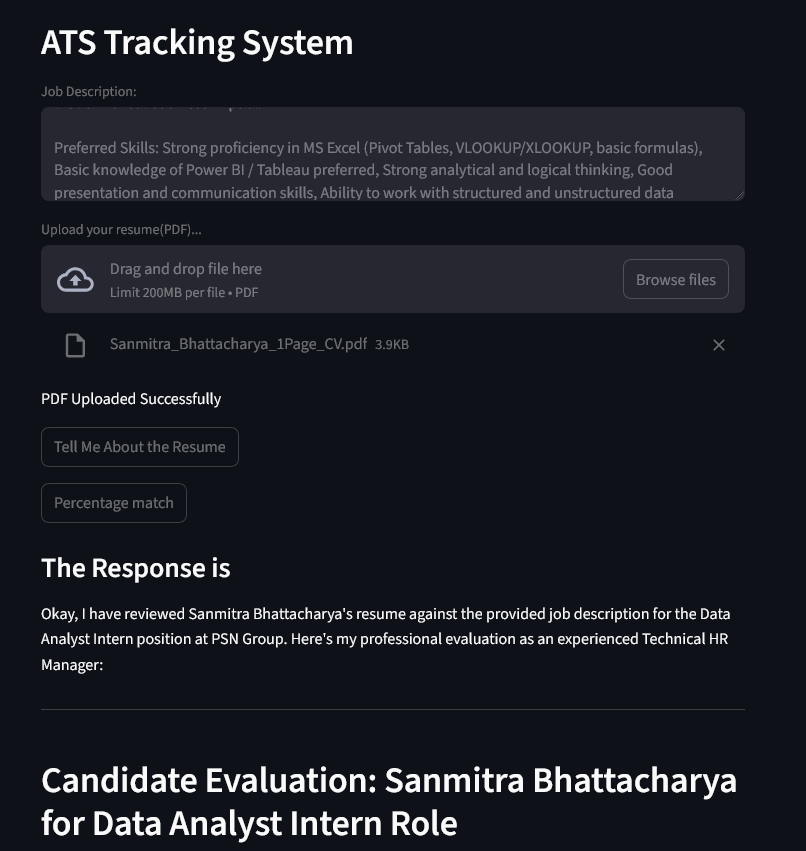
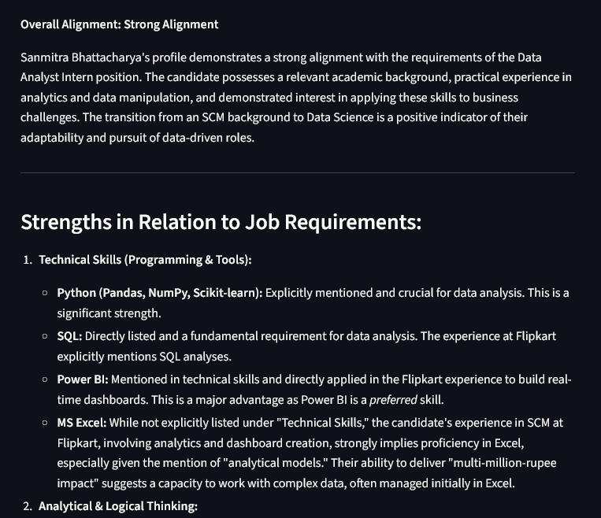

##  Project Title

**ATS-Tracking-System**
A Streamlit-based Applicant Tracking System (ATS) for resume analysis and job description matching


##  Project Description (for README & portfolio)

An intelligent **Applicant Tracking System (ATS)** built with Python and Streamlit that helps job seekers and recruiters evaluate resumes against target job descriptions. The application leverages advanced NLP techniques to extract relevant information from uploaded PDFs, analyze how well a resume aligns with the job requirements, and present a match score plus actionable insights.

This tool streamlines what is traditionally a manual screening process by highlighting strengths, gaps, and keyword alignment, helping users optimize resumes for real-world ATS standards and increasing the likelihood of progressing in the hiring process. ([GeeksforGeeks][1])

---

##  Key Features

* **Resume Upload and Parsing** – accepts PDF resumes and extracts text for analysis
* **Job Description Matching** – compares resume content to a provided job description
* **Match Scoring** – computes a relevance score to indicate alignment with the job role
* **Insight Generation** – highlights missing keywords and text segments that could improve score
* **Streamlit UI** – intuitive web interface for non-technical users

> We will add optional features like ML-based semantic similarity scoring, visualization of matches, or dashboarding later.

---

##  Why This Matters

An ATS is core to modern hiring workflows — it ingests resumes, structures candidate information, filters applicants, and ranks them based on job criteria. This project simulates that process with added analytic feedback meant to help users **optimize their resumes for real screening tools**.

---

##  Live Demo

The application is deployed online and available at:
➡️ **[https://ats-tracking-system-project.streamlit.app](https://ats-tracking-system-project.streamlit.app)**

(If login/authentication error appears, please check deployment settings — ideally provide a direct public link.)

---

##  Tech Stack

* **Python** – core logic
* **Streamlit** – web interface
* **pdf2image / PyPDF2** – PDF text extraction
* **dotenv** – environment variable management
* **AI/NLP utilities** – match scoring & text processing

---

##  Installation (Local Setup)

1. Clone the repository

   ```bash
   git clone https://github.com/sanmitra-b/ATS-Tracking-System.git
   cd ATS-Tracking-System
   ```

2. Create a virtual environment

   ```bash
   python -m venv venv
   source venv/bin/activate   # Windows: venv\Scripts\activate
   ```

3. Install dependencies

   ```bash
   pip install -r requirements.txt
   ```

4. Create a `.env` file and add your API keys (if any)

   ```
   GOOGLE_API_KEY=your_api_key_here
   ```

5. Run the app

   ```bash
   streamlit run app.py
   ```

---

##  Repository Structure

```
ATS-Tracking-System/
├── app.py
├── requirements.txt
├── .gitignore
├── README.md
└── .env (ignored)
```

---

##  Usage

1. Navigate to the local or deployed app URL
2. Upload one or more resume PDFs
3. Enter or paste a job description
4. View the match score and insights recommendations
5. Use the results to tailor your resume for better ATS compliance

## Application Preview






